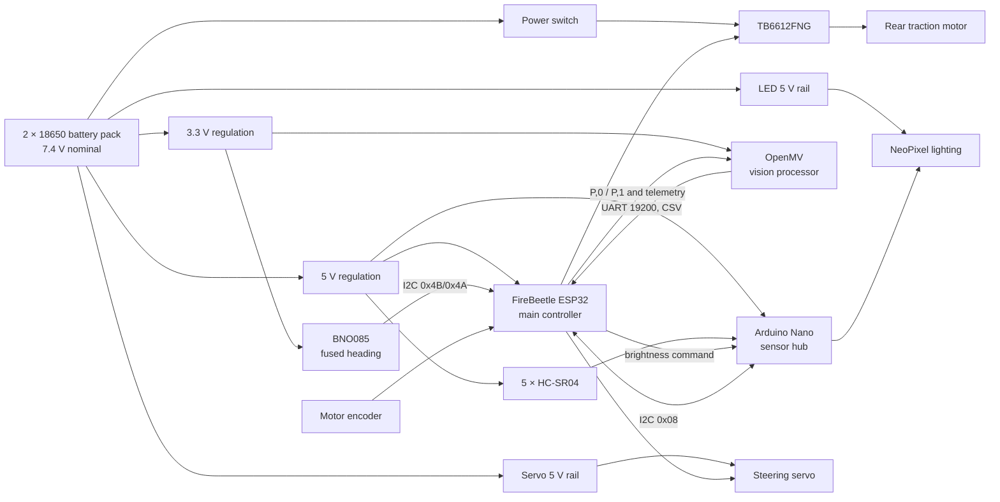
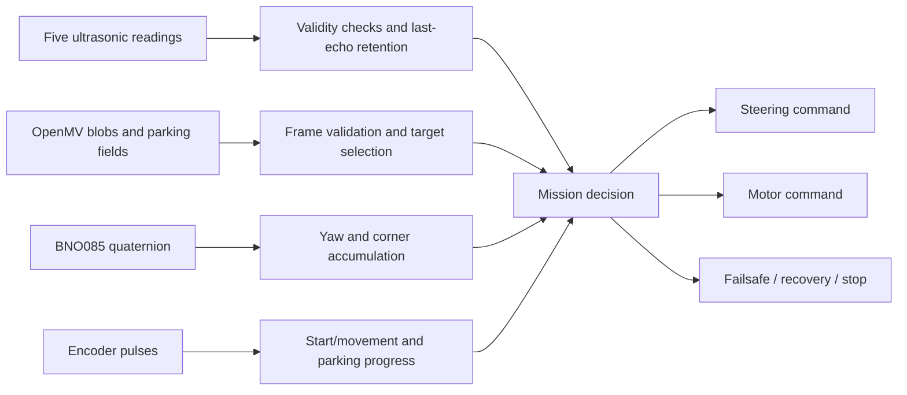
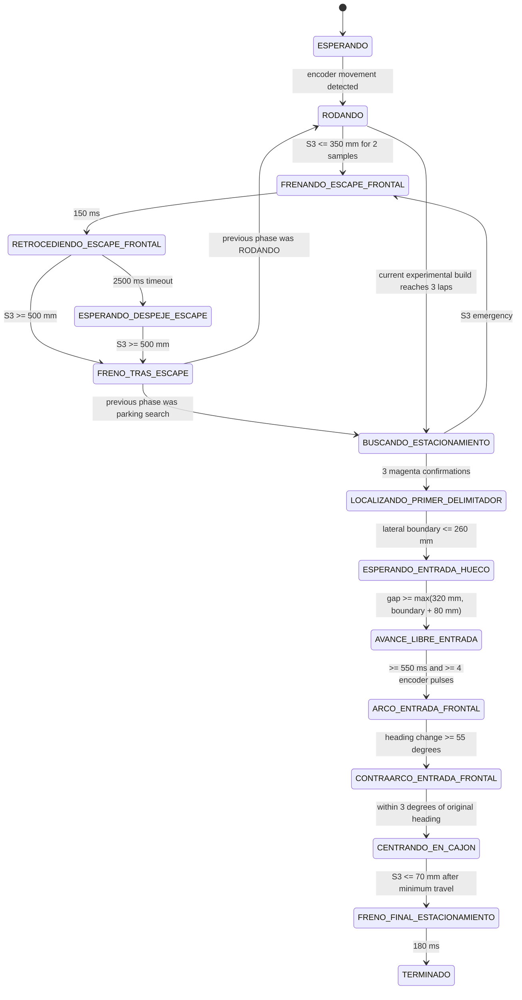

# Superiores — WRO 2026 Future Engineers


This repository contains the engineering documentation, source code, mechanical designs, electrical system and test evidence for Team Superiores' autonomous vehicle for WRO 2026 Future Engineers.

## Team and competition

- **Team:** Superiores / Los Grises Superiores
- **Category:** WRO 2026 Future Engineers
- **Vehicle type:** Four-wheel autonomous vehicle with rear traction and front Ackermann-style steering
- **Students:** Christopher Pérez Cortés and Bárbara Daiana García Balboa
- **Coach:** Eduardo Alvarado González
- **Country:** Mexico
- **Competition event:** [PENDING: official event name and date]

WRO 2026 requires the Open Challenge vehicle to complete three laps. In the Obstacle Challenge it must complete three laps, obey red and green traffic signs, return to the starting section and perform parallel parking.

## Project status

The final physical robot uses a distributed three-controller architecture:

- A DFRobot FireBeetle ESP32 is the main controller.
- An Arduino Nano reads five HC-SR04 ultrasonic sensors and controls the lighting.
- An OpenMV camera performs color and shape detection.
- A BNO085 supplies fused heading data.
- A TB6612FNG drives the rear traction motor.
- A micro-servo actuates the steering rack.

The current software evidence contains two obstacle variants:

1. A three-lap build that stops without parking.
2. A four-lap experimental build containing parking logic.

Neither should be declared as the final WRO competition build until the parking logic starts immediately after the third lap and is validated on the official parking geometry.

The Open Challenge build must also have Wi-Fi disabled and use the WRO-required start-button procedure before it is tagged as a competition release.

## Design objectives

Our design objectives are:

1. Remain inside the WRO limit of 300 × 200 × 300 mm.
2. Remain below 1.5 kg.
3. Use a mechanically linked driving axle instead of differential steering.
4. Maintain controllable steering in both 600 mm and 1000 mm corridors.
5. Detect red and green pillars early enough to pass on the required side.
6. Count laps in clockwise and counter-clockwise rounds.
7. Stop safely when critical sensing or communication is lost.
8. Complete repeatable parallel parking after exactly three obstacle laps.
9. Make the vehicle reproducible from public source code, CAD, wiring and test records.

Current measured dimensions: **[PENDING: length × width × height]**

Competition-ready weight: **[PENDING: measured weight with batteries]**

## System architecture



The electrical diagram reflects the current PCB evidence. Exact regulator loading, battery capacity, protection devices and installed LED topology remain to be measured or confirmed.

## Mechanical design

### Chassis

The 2026 chassis replaced an earlier LEGO-based prototype with printed structural parts. The reason reported in the Engineering Journal was that the LEGO structure occupied too much space and made electronics and sensor placement difficult.

The printed structure includes:

- Lower and upper chassis bodies.
- Front steering structure.
- Central and lateral ultrasonic mounts.
- Rear supports.
- Camera and electronics mounting areas.
- Mounting points for LEGO Technic drivetrain and steering elements.

Development evidence records two important mechanical iterations:

- Parts were sanded when printed clearances did not fit the motor and servo.
- The final chassis needed additional clearance around the drivetrain after a reprint created excessive friction.

The repository currently contains renders only. Native CAD, STL, STEP, drawings, print settings and revision identifiers are required in [`models/`](models/).

### Ackermann-style steering

The front axle uses a micro-servo and a rack-and-pinion linkage. The linkage causes the front wheels to steer together without using differential drive.

Current software settings are:

- Servo center: 90°.
- Maximum software correction: ±40°.
- PWM frequency: 50 Hz.
- Pulse range: 500–2500 µs.
- Parking correction magnitude: 38° in the experimental build.

The exact installed servo is **[PENDING: SG90 or Steren MOT-110, confirmed by a label photograph]**.

To make the Ackermann claim reproducible, the project still needs:

- Wheelbase.
- Front and rear track widths.
- Inner and outer wheel angles.
- Rack travel.
- Minimum turning radius.
- Drawing of steering pivots and tie-rod geometry.

### Traction

The robot uses one rear traction motor connected mechanically to the rear wheels through gearing/differential components. The motor is controlled by channel A of a TB6612FNG.

Current source settings:

- Open Challenge normal command: 100%.
- Open Challenge corner/near-wall minimum: 70%.
- Obstacle Challenge normal command: 70%.
- Obstacle visual-alert command: 40%.
- Obstacle reverse recovery: 45%.
- Parking approach/manoeuvre: 20%/18%.

These percentages are controller commands, not measured linear speeds. Motor model, no-load RPM, stall torque, gearbox ratio and measured vehicle speed are still required.

## Electronics

### Power architecture

The schematic shows a nominal 7.4 V two-cell 18650 supply, a motor-power switch, two Mini-560 regulator modules, two 7805 regulators, a voltmeter and separate named rails for logic, OpenMV/BNO085, servo and LEDs.

The current schematic does not show a fuse or reverse-polarity protection. Earlier development documentation records a reversed-battery incident that damaged a PCB. Protection must be added only after it is actually designed, installed and tested; it must not be claimed in documentation beforehand.

Measured power budget: **[PENDING: publish rail voltage, average current, peak current and regulator temperature]**

### Controllers

| Controller | Real responsibility |
|---|---|
| FireBeetle ESP32 | Main mission logic, steering, motor, BNO085, encoder, lap count, sensor fusion and communications |
| Arduino Nano | Sequential acquisition of five HC-SR04 sensors, I2C slave packet and NeoPixel output |
| OpenMV | QVGA color/shape processing for pillars, collision area, black-wall ROI and magenta parking boundaries |

### Sensors

#### Five HC-SR04 sensors

| Sensor | Position | Nano pins | Main use |
|---|---|---|---|
| S1 | Left, 90° | TRIG D2 / ECHO D3 | Outer-left distance and parking boundary |
| S2 | Left, 25° | TRIG D4 / ECHO D5 | Left corridor alignment |
| S3 | Front | TRIG D6 / ECHO D7 | Corner proximity, emergency reverse and parking stop |
| S4 | Right, 25° | TRIG D8 / ECHO D9 | Right corridor alignment |
| S5 | Right, 90° | TRIG D10 / ECHO D11 | Outer-right distance and parking boundary |

The Nano scans in the order S3, S1, S5, S2, S4. Each echo has a 12 ms timeout and a 2,000 mm maximum accepted distance. Invalid values are transmitted as `0xFFFF`.

#### BNO085

The BNO085 shares the I2C bus with the Nano and is tried at addresses `0x4B` and `0x4A`. The ESP32 requests `SH2_GAME_ROTATION_VECTOR` reports every 10 ms and derives yaw from the quaternion.

The BNO085 is used for:

- Locking the clockwise/counter-clockwise turn sign.
- Accumulating heading changes.
- Confirming each 90° corner.
- Counting three laps.
- Guiding reverse recovery.
- Controlling parking arc/contra-arc heading in the experimental build.

#### OpenMV

The camera captures QVGA RGB565 images at 320 × 240. It initially enables automatic gain, white balance and exposure, waits 800 ms, then freezes the selected values. The exact exposure remains automatic at boot and must be recorded during final calibration.

UART settings:

- OpenMV UART bus 3.
- ESP32 UART2.
- 19200 baud, 8N1.
- OpenMV TX → ESP32 RX/GPIO25.
- OpenMV RX ← ESP32 TX/GPIO26.
- Shared ground.

## Software architecture

Complete software details are in [`src/README.md`](src/README.md).

### Main data flow



### Open Challenge

The Open program uses the left/right ultrasonic error:

```text
error = (S1 + S2) - (S4 + S5)
```

It applies PID control with:

- `KP = 0.04`
- `KI = 0.001`
- `KD = 0.003`
- Integral contribution limited to ±8°.
- Derivative filter coefficient `0.25`.
- Steering changes limited to 10° per sensor update.

The front sensor gradually increases control strength and reduces speed between 1,000 mm and 300 mm. A frontal reading at or below 300 mm starts a brake/reverse recovery; forward travel resumes at or above 450 mm.

A BNO085-based guard is applied around each 90° corner. The mission ends after twelve confirmed quarter turns.

### Obstacle Challenge

OpenMV assigns:

- ID 5 to red.
- ID 3 to green.
- ID 0 to no pillar.

The OpenMV sends the lower-left reference of green pillars and the lower-right reference of red pillars. The ESP32 targets:

- Red at normalized X = −45, keeping it to the left so the robot passes on its right.
- Green at normalized X = +45, keeping it to the right so the robot passes on its left.

Camera control is proportional with `KP_CAMARA=1.0` and a ±30° limit. When no valid pillar exists, proportional corridor control uses `KP_PASILLO=4.0`.

If OpenMV communication is lost for 500 ms, the program clears the pillar target and falls back to ultrasonic corridor control. If Nano distance packets are lost for 250 ms or S3 remains invalid, movement stops.

### Obstacle state machine



**Compliance warning:** the experimental program counts a fourth lap during the parking search. The competition build must enter parking after the third lap without completing a fourth lap.

## Parking strategy

The experimental strategy combines:

1. OpenMV detection of wide magenta blobs.
2. Three-frame wall confirmation.
3. Two-frame gap confirmation.
4. Selection of the parking side from the camera X position or the outside of the established round direction.
5. S1 or S5 to detect the first magenta boundary and the opening.
6. A forward arc of 38° steering until a 55° heading change.
7. A counter-arc until the original heading is recovered within 3°.
8. Straight movement until S3 reaches 70 mm.
9. Active braking and final stop.

This is implemented but is not yet supported by a complete WRO-format video or test dataset. See [`docs/parking-strategy.md`](docs/parking-strategy.md).

## Vision strategy

Important active OpenMV parameters include:

- Red thresholds:
  - `(22,48,38,63,16,46)`
  - `(28,52,43,65,17,49)`
- Green threshold:
  - `(35,75,-50,-15,-20,25)`
- Magenta threshold:
  - `(35,90,30,70,-50,5)`
- Red/magenta classifier:
  - Parking accepted at B mean ≤ 0.
  - Red pillar accepted at B mean ≥ 12.
- Pillar minimum area: 60 px box area.
- Minimum pillar density: 60%.
- Parking minimum width/height/area: 20 px / 6 px / 120 px.
- Parking minimum width-to-height ratio: 1.40.
- Parking minimum density: 55%.

These values are current code settings, not universal values. They must be revalidated using the real competition lighting and physical objects.

## Calibration and testing

- [`docs/calibration.md`](docs/calibration.md) contains reproducible procedures and source constants.
- [`docs/testing/protocol.md`](docs/testing/protocol.md) defines controlled tests.
- [`docs/testing/results.csv`](docs/testing/results.csv) stores every attempt.
- [`docs/compliance-checklist.md`](docs/compliance-checklist.md) records rule compliance.

Existing README success rates have not been retained as verified results because their source records were not found.

## Engineering iterations

Evidence currently supports the following development path:

1. LEGO/EV3 prototype.
2. Transition to a printed chassis.
3. Sensor expansion from three to five ultrasonic sensors.
4. HuskyLens experimentation followed by OpenMV.
5. Servo and steering-mechanism iterations.
6. Custom PCB and correction of solder bridges.
7. Replacement of a PCB after reverse-polarity damage.
8. BNO085 lap counting.
9. OpenMV firmware 5 to firmware 6, including red/magenta classification.
10. Addition of frontal recovery and experimental parking states.

See [`docs/engineering-journal/engineering-journal.md`](docs/engineering-journal/engineering-journal.md).

## Photographs

| Front | Back |
|:---:|:---:|
|  |  |

| Left | Right |
|:---:|:---:|
|  |  |

| Top | Bottom |
|:---:|:---:|
|  |  |

Team photograph:


## CAD and fabrication

Mechanical files belong in [`models/`](models/). At present, only renders are available.

Required before final submission:

- [ ] Native CAD source or public view-only project.
- [ ] STL for every printed part.
- [ ] STEP for every custom part.
- [ ] Dimensioned drawings.
- [ ] Print settings and material.
- [ ] Revision that matches the photographed robot.

The PCB schematic, fabrication PDF, Gerbers and BOM belong in [`schemes/`](schemes/).

## Source code

| Target | Location |
|---|---|
| ESP32 Open Challenge | `src/esp32-main/open-challenge/` |
| ESP32 Obstacle Challenge | `src/esp32-main/obstacle-challenge/` |
| Arduino Nano sensor hub | `src/nano-sensor-hub/` |
| OpenMV firmware | `src/openmv/` |
| Calibration/test utilities | `src/esp32-main/tools/` |

## Build and upload

1. Inspect the battery polarity and keep the motor-power rail disconnected.
2. Upload the Nano sensor-hub sketch.
3. Upload `color_corner_v6.py` to the OpenMV and configure it as the boot script.
4. Upload the chosen ESP32 challenge build.
5. Verify I2C addresses `0x08` and `0x4B`/`0x4A`.
6. Verify UART at 19200 baud.
7. Center the steering with the wheels lifted.
8. Confirm motor direction with the wheels lifted.
9. Run the calibration checklist.
10. For competition, verify Wi-Fi/Bluetooth are disabled and use the single start button.

Exact IDE, core and library versions are listed in `src/README.md` once confirmed.

## Videos

| Open Challenge | Obstacle Challenge |
|:---:|:---:|
| [](https://www.youtube.com/watch?v=diX7vBUeAKw) | [](https://www.youtube.com/watch?v=LjnSCSj2Bsk) |
| 1:14 autonomous driving demonstration | 1:43 obstacle-driving demonstration; parking is not shown |

Detailed video metadata and required replacement footage are documented in [`video/video.md`](video/video.md).

## Repository organization

```text
src/       source code for all programmed controllers
models/    native CAD, STEP, STL, drawings and renders
schemes/   electrical schematic, editable PCB, Gerbers and BOM
docs/      journal, build, calibration, strategy and testing
v-photos/  six required vehicle views
t-photos/  team photographs
video/     YouTube links and recording metadata
archive/   clearly labelled historical material
```

## License

Software and documentation licensing: see [`LICENSE`](LICENSE).

Hardware/CAD licensing: **[PENDING: confirm whether the MIT license is also intended to cover hardware design files]**

## Official references

- [WRO 2026 Future Engineers rules](https://wro-association.org/wp-content/uploads/WRO-2026-Future-Engineers-Self-Driving-Cars-General-Rules.pdf)
- [WRO 2026 documentation rubric](https://wro-association.org/wp-content/uploads/WRO-2026-Future-Engineers-Documentation-Rubric.pdf)
- [WRO Future Engineers repository template](https://github.com/World-Robot-Olympiad-Association/wro2022-fe-template)
- [WRO 2026 Questions & Answers](https://wro-association.org/competition/questions-answers/)
